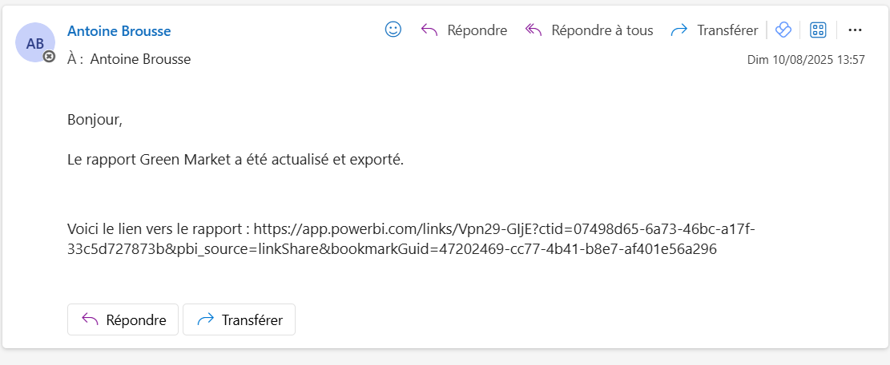

# Étude de cas – Automatisation de l’actualisation d’un rapport Power BI à partir de fichiers Excel OneDrive

## 📌 Contexte
Green Market est une PME fictive spécialisée dans la vente de produits alimentaires et d’articles éco-responsables.
L’entreprise enregistre ses ventes mensuelles dans des fichiers Excel stockés sur OneDrive.

Avant ce projet, chaque fois qu’un nouveau fichier était ajouté, les équipes devaient :
- Importer manuellement le fichier dans Power BI.
- Nettoyer les données : suppression des colonnes inutiles, correction des formats (dates, montants…), renommage des champs.
- Resélectionner les colonnes pertinentes et reparamétrer les transformations nécessaires.
- Rafraîchir manuellement le rapport.
- Envoyer la version mise à jour aux équipes commerciales.

Ce processus était **chronophage**, répétitif et sujet à des oublis.

---

## 🎯 Objectif
Mettre en place une solution qui permette à Green Market de disposer en permanence d’un rapport Power BI à jour et prêt à l’analyse, sans aucune intervention humaine, en automatisant :
- L’importation des nouveaux fichiers Excel stockés sur OneDrive.
- Le nettoyage et la transformation des données (sélection des colonnes pertinentes, mise au bon format, suppression des champs inutiles) directement dans Power Query.
- L’intégration automatique des nouvelles données dans le modèle Power BI.
- Le rafraîchissement du rapport sur Power BI Service.
- L’envoi automatique d’une notification par email avec le lien vers le rapport actualisé.

En résumé, dès qu’un fichier de ventes est ajouté dans OneDrive, le rapport Power BI est immédiatement prêt à être consulté, sans aucune manipulation manuelle.

---

## 💡 Solution mise en place

### 1. **Connexion Power BI ↔ OneDrive**
- Lien direct entre Power BI et le dossier OneDrive contenant les fichiers Excel.
- Dans **Power Query** :
  - Sélection et formatage des colonnes nécessaires (dates, produits, montants…).
  - Normalisation des formats (dates, décimales…).
  - Transformation des données pour garantir une cohérence d’analyse.

### 2. **Automatisation avec Power Automate**
- **Déclencheur** : détection d’un nouveau fichier dans le dossier OneDrive.
- **Actions** :
  1. Actualisation du dataset Power BI sur le Service.
  2. Envoi d’un email automatique aux équipes avec :
     - Un **lien direct** vers le rapport Power BI actualisé.
    
Flux sur power automate :

---

## 🧪 Phase de test du workflow

Afin de valider le bon fonctionnement du processus automatisé, une série de tests a été réalisée sur l’ensemble du flux.

1. Préparation des fichiers de test
- Création de plusieurs fichiers Excel simulant des ventes mensuelles (janvier à juillet).
- Vérification que leur structure correspond au modèle attendu par Power Query (mêmes colonnes, formats cohérents).
- Ajout d’un fichier de test volontairement incomplet pour analyser la gestion des erreurs.

2. Simulation d’ajout dans OneDrive
- Ajout manuel d’un fichier Excel dans le dossier surveillé par Power Automate.
- Observation du déclenchement automatique du flux.

3. Contrôle des étapes du flux
- Vérification que Power BI détecte le nouveau fichier.
- Validation que Power Query applique correctement les transformations prévues (nettoyage, sélection des colonnes, formats).
- Confirmation que le dataset Power BI est rafraîchi sur le Service.

4. Vérification de la notification email
- Réception d’un email automatique à l’adresse configurée.
- Contrôle du contenu : présence du lien vers le rapport Power BI actualisé.

email reçu après le déclanchement du flow power automate : 

5. Test en conditions réelles
- Aperçu du flux sur power automate après l'ajout d’un nouveau fichier avec des ventes fictives d’août.

Résultat : le workflow a permis d’intégrer un nouveau fichier de ventes et d’actualiser le rapport sans aucune intervention manuelle, confirmant l’efficacité et la fiabilité du processus

---

## 📊 Résultats obtenus
- **Gain de temps** : plus besoin de manipulations manuelles chaque mois.
- **Réduction des erreurs** : suppression des oublis et des incohérences dans les données.
- **Accès instantané** : le rapport est disponible en temps réel après l’ajout d’un fichier.
- **Meilleure communication** : tous les destinataires sont informés automatiquement.

---

## 🛠️ Stack technique
- **Power BI Service** (connexion directe à OneDrive + Power Query pour la transformation des données)
- **Power Automate** (déclenchement et envoi des notifications)
- **OneDrive** (stockage centralisé des fichiers Excel)
- **Microsoft Outlook** (diffusion par email)

---

## 🚀 Améliorations possibles
- Ajout d’un **résumé automatique des indicateurs clés** dans l’email.
- Archivage automatique des anciens rapports sur SharePoint.
- Mise en place d’un tableau de bord consolidé multi-années.

---

## 📌 Note
Ce projet est basé sur un scénario fictif mais reproduit fidèlement un **cas d’usage réel en entreprise**.
Il démontre ma capacité à :
- **Connecter Power BI à des sources cloud** (OneDrive)
- **Transformer et préparer les données** avec Power Query
- **Automatiser un processus de reporting complet** avec Power Automate
- **Améliorer la productivité et la qualité des données**
  
Antoine Brousse
